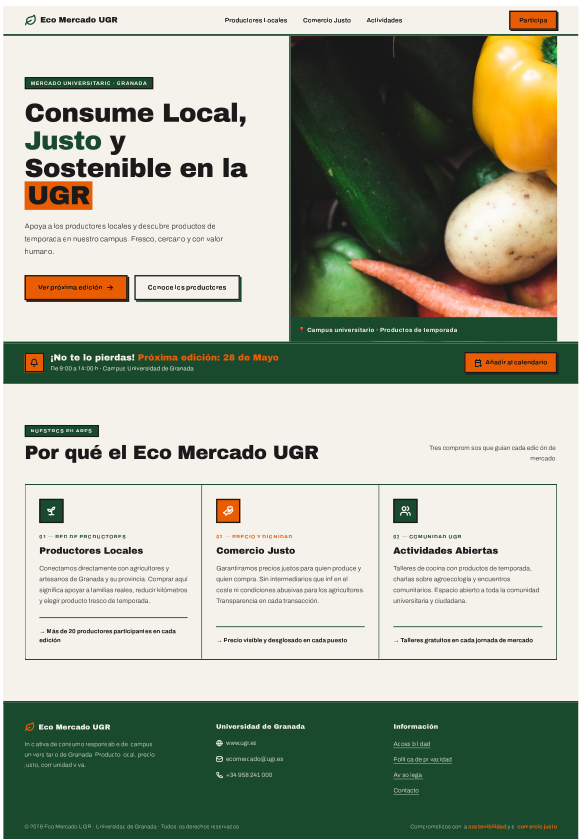

# PARTE II: Caso de estudio: Propuesta de diseño ECO MERCADO UGR

## 1. Análisis de Iniciativas Existentes

El primer paso metodológico del **DCU** es comprender los modelos mentales existentes. Analizando plataformas del sector ecológico (ej. Huerta Madrid), observamos deficiencias recurrentes en la Arquitectura de la Información.

**Arquetipo de Usuario y Factor Humano:**
El arquetipo incluye "foodies" locales y comunidad universitaria. Sus motivaciones (*End Goals*) son localizar productos frescos, pero sus motivaciones reflexivas (*Life Goals*) radican en el consumo ético. Requieren información inmediata en contexto móvil (*Just It*).

**Evaluación UX/UI:**
Las plataformas actuales suelen fallar en la **Heurística 8 de Nielsen (Diseño estético y minimalista)**, presentando alta densidad cognitiva. Carecen de un enfoque estricto **Mobile First**, penalizando la usabilidad móvil. Además, frecuentemente incumplen los **principios POUR**, presentando fallos en la directriz 1.4 (Distinguible) por bajo contraste y problemas de operabilidad por teclado.

## 2. Extracción de Insights y Propuesta de Valor

**Propuesta de Valor:**
El usuario necesita inmediatez, transparencia y confianza. Por ello, el Eco Mercado UGR se posiciona bajo un patrón de **Landing Page** clara y orientada a la conversión informativa ("Ver próxima edición").

**Requisitos Funcionales y No Funcionales:**
* **Eficiencia (Funcional):** Minimizar la carga cognitiva y el tiempo de decisión (**Ley de Hick**). Acción principal reducida a una sola vía.
* **Accesibilidad (POUR - No Funcional):** Debe ser **Perceptible** (alto contraste), **Operable** (CTAs grandes cumpliendo la **Ley de Fitts**) y **Comprensible** (lenguaje claro).
* **Adaptabilidad (No Funcional):** Implementación de **Diseño Responsive** (*fluid grid layouts*).

## 3. Planteamiento y Justificación del Rediseño (Análisis del Mockup)

A continuación se muestra el mockup diseñado para el Eco Mercado UGR:

  
  

🔗 **[Explorar prototipo interactivo en Figma](https://output-iframe-26114267.figma.site/)**

**Justificación de Diseño:**
* **Jerarquía Visual:** Patrón de escaneo en "F" y "Z", guiando el ojo desde el logotipo hasta el **CTA**. La Arquitectura de la Información reduce la carga de memoria a corto plazo (**Heurística 6 de Nielsen**).
* **Leyes de Gestalt:** En la sección inferior, se aplican la **Ley de la Proximidad y Ley de Región Común**. Los pilares de la propuesta envueltos en tarjetas con bordes sólidos se perciben como grupos relacionados instantáneamente.
* **Estilo Visual (Neo-Brutalism):** Adopción de colores de **alto contraste**, trazos negros gruesos y colores neutros combinados con naranjas vibrantes (*Intentional Color*) para los CTAs. Garantiza el **Efecto de Estética-Usabilidad**, transmitiendo una personalidad auténtica sin sacrificar la legibilidad de la tipografía *sans-serif*.

## 4. Autoevaluación Comparativa (Prácticas vs. Caso Real)

**¿Qué técnicas de mis prácticas aplicaría en este caso?**
1. **Mapeo de Usuarios:** Uso de *Personas* y *Empathy Maps* (Lean UX) para evitar el sesgo del diseñador y detectar *pain points*.
2. **Evaluación Mixta:** Uso de métricas biométricas (*Eye Tracking* con GazeMapping) para validar el foco visual en el CTA, y encuestas estandarizadas **SUS** para la validación numérica de la usabilidad directa.

**¿Qué me ha faltado por hacer para garantizar el éxito?**
1. **Accesibilidad Inclusiva Profunda:** En las prácticas nos apoyamos en validadores automáticos (WAVE). Para este caso institucional, es vital realizar testeos con **usuarios reales que posean capacidades diferentes** (ej. lectores de pantalla) para asegurar semánticamente el cumplimiento de las directrices WCAG y atributos ARIA.
2. **Iteración Ágil:** Siguiendo la filosofía **Lean UX** ("Think-Make-Check"), faltó implementar ciclos de iteración continuos (pivotar) confrontando el prototipo periódicamente con los productores y usuarios del campus.

